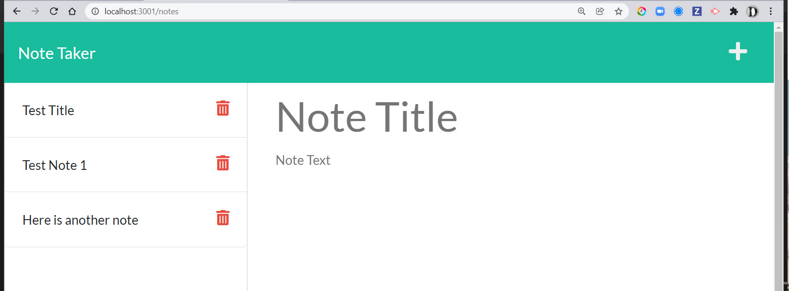

# Note-Taker

## Description
This is an application that will allow a user to create a note and save it for later. You will title the note and then add any applicable text for the note below. Click the save button and it will display in the left side of the screen. You can add multiple notes by following the same steps.

## Screenshot 

